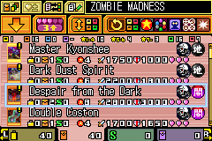
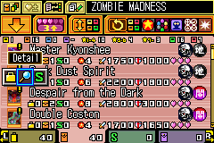
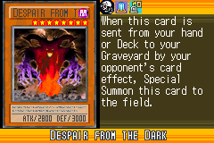

# P1：卡牌信息页面内容定位——Phase A 分析报告

**分析日期**: 2026-04-14  
**工具**: mGBA 0.10.5 + mgba-live-mcp  
**ROM**: 游戏王 EX2006（2343.gba）  
**参考方案**: `doc/dev/p1-card-image-location-plan.md`

---

## 一、调试场景

从 ss1 存档（卡组列表界面）出发，按 A → A 进入卡牌信息页面，捕获前后 VRAM 快照并对比差异。

| 状态 | 说明 | 截图 |
|------|------|------|
| 状态1 | 卡组列表（基准快照） |  |
| 状态2 | 按 A 后弹出子菜单（Detail） |  |
| 状态3 | 再按 A 进入卡牌信息页面 |  |

当前测试卡牌：**DESPAIR FROM THE DARK**（ATK/2800 DEF/3000，暗属性）

---

## 二、IO 寄存器（状态3）

读取地址 `0x04000000`，长度 16 字节：

```
原始: 40 1F 00 00 19 00 A0 00 86 00 04 41 07 04 05 03
```

| 寄存器 | 地址 | 原始值 | 含义 |
|--------|------|--------|------|
| DISPCNT | `0x04000000` | `0x1F40` | mode=0，BG0+BG1+BG2+BG3+OBJ 全部启用 |
| BG0CNT | `0x04000008` | `0x0086` | pri=2，charblock=1（tile@`0x06004000`），sblk=0（map@`0x06000000`），256色 |
| BG1CNT | `0x0400000A` | `0x4104` | pri=0，charblock=1（tile@`0x06004000`），sblk=1（map@`0x06000800`），16色，size=1 |
| BG2CNT | `0x0400000C` | `0x0407` | pri=3，charblock=1（tile@`0x06004000`），sblk=4（map@`0x06002000`），16色 |
| BG3CNT | `0x0400000E` | `0x0305` | pri=1，charblock=1（tile@`0x06004000`），sblk=3（map@`0x06001800`），16色 |

**注意**：所有 BG 层的 tile 数据基址均为 `0x06004000`（charblock=1）。  
tile 编号超过 charblock 1 容量（≥512 个 4bpp tile 或 ≥256 个 8bpp tile）时，会自动延伸至 charblock 2（`0x06008000`）。

---

## 三、VRAM Diff（状态1 → 状态3）

**总变化字节数**：11,746  
**合并后区间数**（gap 容限 64B）：16

### 3.1 主要区间（按大小排序）

| 排名 | VRAM 地址范围 | 大小 | VRAM 区域 | 推断内容 |
|------|--------------|------|-----------|---------|
| 1 | `0x06008040–0x0600933F` | **4,864 B** | Charblock 2 | **卡牌大图 tile 数据** |
| 2 | `0x0600004C–0x06000933` | **2,280 B** | Charblock 0 / Screenblock 0–1 | BG0/BG1 tilemap 更新 |
| 3 | `0x06010005–0x060107FC` | **2,040 B** | Sprite tile 区 | UI 元素 / 图标 tile |
| 4 | `0x06017260–0x060175FE` | 927 B | Sprite tile 区 | 图标或文字 sprite |
| 5 | `0x06010882–0x06010BFE` | 893 B | Sprite tile 区 | 图标或文字 sprite |
| 6 | `0x06010C81–0x06010FF6` | 886 B | Sprite tile 区 | 图标或文字 sprite |
| 7–16 | 其余 Sprite tile 区 | 116–499 B 各 | Sprite tile 区 | 各类小图标 |

### 3.2 卡牌大图区间详情

```
0x06008040 – 0x0600933F  （4,864 字节 = 76 个 8bpp tile × 64B）
```

- 起始地址 `0x06008040` = Charblock 2（`0x06008000`）偏移 `0x40`（跳过前 1 个 tile）
- 8bpp（256色）tile 每个 64 字节；4,864B ÷ 64 = **76 tiles**
- 卡图实际像素：76 tiles × 8×8 = 4,864 像素（约 **48px × ~102px**，接近标准 GBA 卡图尺寸）
- BG0 以 charblock=1 为基，tile 编号从 `0x06004000` 起算；编号 256 开始即落入 `0x06008000`，与本区间吻合

> **结论**：`0x06008040` 是卡牌大图 tile 数据在 VRAM 中的起始地址，**Phase B2 watchpoint 首选目标**。

### 3.3 Tilemap 区间详情

```
0x0600004C – 0x06000933  （2,280 字节）
```

- 覆盖 Screenblock 0（`0x06000000–0x060007FF`，BG0 tilemap）大部分区域
- 同时覆盖 Screenblock 1（`0x06000800–0x06000FFF`，BG1 tilemap）部分区域
- tilemap 每条目 2 字节，2,280B ÷ 2 = 1,140 个条目发生变化
- 对应画面大区域 tile 布局重排（从卡组列表切换到卡牌信息页面的完整重绘）

### 3.4 Sprite tile 区间详情

`0x06010000–0x06018000`（32KB）为 OAM sprite tile 数据区，共有 **5 段较大变化**：

| 区间 | 大小 | 可能内容 |
|------|------|---------|
| `0x06010005–0x060107FC` | 2,040 B | 属性图标 / 种族图标 / UI 边框 sprite |
| `0x06017260–0x060175FE` | 927 B | 星级图标 / 数字 sprite |
| `0x06010882–0x06010BFE` | 893 B | 攻击力/守备力数字 |
| `0x06010C81–0x06010FF6` | 886 B | 同上（第二组数字/图标）|
| 其余 11 段 | 116–499 B 各 | 各类小图标 |

---

## 四、OAM 对比

### 状态1（卡组列表）
```
精灵 0-6：  attr0=0x4074(y=116), attr1=0x00D0/0x0070..., attr2=0xA43D  — 横排排列
精灵 7-8：  attr0=0x805C, attr2=0xA39C/E                               — 纵向边框
精灵 9-21： attr0=0x405C(y=92),  attr2=0xA39D                          — ATK/DEF 装饰
精灵 28-35：attr0=0x0089 系列,   attr2=0x9BE0 系列                      — 数字精灵
精灵 38-39：attr0=0x2030/0x8057                                         — 光标/特效
```

### 状态3（卡牌信息页）
```
精灵 0：    attr0=0x0006(y=6),   attr1=0x4056, attr2=0xD3A2            — 卡片框上角装饰
精灵 1-8：  attr0=0x0016(y=22),  attr1=0x005C..0x0024（X 依次减小）     — 星级图标（8 颗）
精灵 9-10： attr0=0x2000/0x2000, attr1=0x40F0/0x4100, attr2=0x03AC/B4  — ATK/DEF 标签
精灵 12-27：attr0=0x4010 系列,   attr1=0x40F0 系列, attr2=0xF802 系列   — ATK/DEF 数字（4×4 组）
```

> 星级图标（精灵 1-8）共 8 颗，均排列在 y=22 行，X 坐标从 92 依次减 8，向左排开。

---

## 五、Phase B2 目标地址汇总

| 优先级 | VRAM 地址 | 内容 | watchpoint 目的 |
|--------|-----------|------|----------------|
| ⭐ 最高 | `0x06008040` | 卡牌大图 tile 数据起始 | 追溯卡图 ROM 来源 |
| 高 | `0x06010005` | Sprite tile 区起始（UI/图标）| 追溯图标/UI ROM 来源 |
| 中 | `0x06000800` | BG1 tilemap 起始 | 追溯 tilemap 写入逻辑 |

---

## 六、后续工作

1. **Phase B2**：对 `0x06008040` 设 GDB watchpoint，触发卡牌信息页加载，捕获写入 PC 和源寄存器
2. 若源地址在 EWRAM（经过中间缓存），继续向上追踪至 ROM 地址
3. 对图标/UI sprite tile 区（`0x06010005`）重复上述步骤
4. 最终目标：在 ROM 中定位卡牌大图的压缩数据块起始偏移
