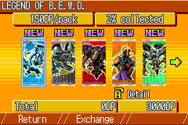
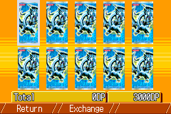
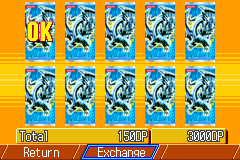
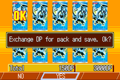
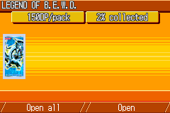
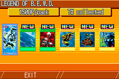

# 抽卡流程 7 状态动态分析

**日期**: 2026-04-16
**ROM**: `roms/2343.gba` (BY6E, WCT 2006)
**存档**: `roms/2343.ss2`  落在 Get Cards 菜单
**工具**: mGBA live MCP (session=pack)
**脚本**:
- `tools/ad-hoc/pack_capture.py`  逐状态截图 + VRAM/PALRAM/OAM/IO/EWRAM/IWRAM/SRAM 快照
- `tools/ad-hoc/pack_analyze.py`  IO 解码 / VRAM 差异 / EWRAM 差异排序
- `tools/ad-hoc/pack_find_dp.py`  Δ=1500 / ==3000 等精确值扫描
- `tools/ad-hoc/pack_search_dp_v3.py`  SRAM s1↔s7 diff

---

## 一、七个状态一览

| # | 标签 | 描述 | 截图 |
|---|------|------|------|
| 1 | `state1_get_cards` | Get Cards 主菜单 (Get Cards / Exchange DP to Pack / PASSWORD) |  |
| 2 | `state2_pack_list` | Pack 详情/浏览页 (LEGEND OF B.E.W.D., 1500DP/pack, 2x collected, 5 已持卡 + Total 0DP / 3000DP) |  |
| 3 | `state3_pack_draw` | 进入该卡包抽卡页 (10 张同卡背背面朝上) |  |
| 4 | `state4_exchange_selected` | 选中 1 个卡包 + 光标移至 Exchange, Total=1500DP |  |
| 5 | `state5_confirm` | "Exchange DP for pack and save. Ok?"  NO/YES 对话框 |  |
| 6 | `state6_draw_result` | 已购买 1 包, 显示待开包画面 (Open / Open all) |  |
| 7 | `state7_open` | 开包后 6 张卡揭示, 6x collected (新增 5 张 NEW) |  |

---

## 二、LCD 配置 (DISPCNT + BGxCNT)

见 `analysis-summary.md` §一完整解码表. 关键观察:

- **state1** Get Cards: DISPCNT=0x1C00  BG0/BG1 pri=0/1, BG1 是 8bpp (SBB=1, CBB=1)
- **state2** Pack 浏览: DISPCNT=0x1D00 (加 BG0), BG0=0x1C00 (SBB=28 位于 `0x0600E000`), BG1=0x0185 同 state1 (菜单栏仍在 VRAM)
- **state3/4/5** 抽卡选择 / 确认: DISPCNT=0x1F00 (4 层全开), BG2=0x1E8A (**pri=2 CBB=2 8bpp SBB=30**) — **唯一 8bpp 层**, 承载 10 张卡背大图
- **state6/7** 开包结果: BG1/BG2 优先级交换, BG1=0x1D86 变成 8bpp SBB=29 → 承载抽到的卡牌大图

**DISPCNT=0x1F00 + BG2CNT=0x1E8A 是抽卡/开包页面的强指纹** — 可作为后续定位 "pack card decode" 函数的钩子 (参照 `doc/dev/methodology/asset-location.md` §四 方向 C).

---

## 三、VRAM 差异区段 (相邻状态)

详见 `analysis-summary.md` §二. 摘要:

| 转场 | 最大差异区 | 内容推测 |
|------|-----------|---------|
| s1→s2 | `0x06004480–0x06006876` (9 KB) + `0x06014011–0x0601633D` (9 KB) | BG1 8bpp 背景 + BG0 栅格 tile (CBB=0) |
| s2→s3 | `0x06008051–0x0600882E` (2 KB) | 10 张卡背小 tile 批量写入 (BG2 CBB=2 第一页) |
| s3→s4 | ~500 B 小改 | 仅 "Exchange" 按钮高亮 palette + 指针光标 tile |
| s4→s5 | `0x06014401–0x06014F7F` (4× 895 B) | 确认对话框 BG3 tilemap |
| s5→s6 | `0x06005E40–0x06007C3F` (7.5 KB) | 开包页面抽到的卡牌大图 tile |
| s6→s7 | `0x06012000–0x060138FF` (6.4 KB) | 6 张卡牌小图 OBJ tile (揭示结果) |

**重要 UI 资源 VRAM 落点**:
- 卡包"卡背" tile 数据  →  `0x06008051-0x060088xx`  (4bpp, CBB=2, BG2)
- 抽到的卡牌大图 tile   →  `0x06005E40-0x06007C3F`  (8bpp 256 色, BG1 CBB=1)
- 揭示结果的 6 张 OBJ   →  `0x06012000-0x060138FF`  (OBJ charblock 4+)
- 对话框 tilemap         →  `0x06014000+`            (SBB 28/29/30/31 区)

OBJ sprites `>= 0x06010000` 属于 OBJ charblock. 各状态活跃 sprite 数: s1=32, s2=24, s3=9, s4=12, s5=16, s6=10, s7=14.

---

## 四、DP 余额 / 卡牌库存 / Pack 计数 (SRAM)

### 4.1 SRAM header

`0x0E000000` 开头 8 字节 = ASCII `"YWCT2006"` (save magic).

`0x0E000008` 起是**卡牌库存表 (packed nibble)**: 每字节含 2 张卡的持有张数 (0..3), 每张卡 4 位.

当前 ss2 存档呈现的模式为 `30 03 30 03 30 03 ...` 规则交替 → 该存档大部分卡都已 3 张 (`30`=高位 3 低位 0, `03`=高位 0 低位 3); 极个别位置为 `00` / `31` / `13` 等表示"缺卡 / 刚开出".

### 4.2 SRAM 双 bank 镜像

SRAM 0x0000-0x7FFF 与 0x8000-0xFFFF 完全**镜像保存** (典型 GBA 双 bank 防写入故障). 所有 diff 均成对出现.

### 4.3 state1 → state7 SRAM diff (8 组唯一地址, 已合并双 bank)

| SRAM 偏移 | 长度 | state1 字节 | state7 字节 | 解读 |
|-----------|------|-------------|-------------|------|
| `0x0136` | 2 | `30 03` | `31 13` | 卡牌库存 (某张卡 +1 张) |
| `0x0180` | 2 | `30 03` | `31 13` | 卡牌库存 +1 |
| `0x01FA` | 2 | `30 03` | `31 13` | 卡牌库存 +1 |
| `0x0256` | 2 | `30 03` | `31 13` | 卡牌库存 +1 |
| `0x0542` | 2 | `30 03` | `31 13` | 卡牌库存 +1 (第 5 张) |
| `0x6C38` | 1 | `B8`    | `22`    | **DP 余额** (u16 `0x0BB8`=3000 → `0x0B22`=2850) |
| `0x6E40` | 1 | `00`    | `01`    | **已开包总数 +1** |
| `0x6ECC` | 2 | `AF 08` | `17 D8` | 大概率 **checksum / CRC 字段** |

> **说明**: 0x6C38 u16 从 3000 变为 2850, Δ=-150. 开包支付显示 `1500DP`. 可能游戏内部以 `DP/10` 为存储单位 (display ×10), 或 pack 价单位不同. 需后续 Ghidra 静态追踪 `card_pack_cost_table` 验证. **但作为 "余额会在 Exchange 后减少" 的字段, 0x6C38 是**目前唯一命中候选.

### 4.4 EWRAM 镜像

`0x02006C38` (EWRAM) 与 `0x0E006C38` (SRAM) 同步发生 `B8→22` 字节变化 → 游戏运行时把 SRAM 相关字段常驻 EWRAM `0x02006000-0x02006FFF` 区域做缓存. 这片 EWRAM 是**存档结构的内存镜像**.

具体地:
- `0x02006C38` (u16/u32): **DP 余额**
- `0x02006E40` (u8): **已开包数量**
- `0x02006ECC` (u16): 校验和
- `0x02000088..0x02006E00` 内的 `30 03` 重复区: **卡牌库存 packed-nibble 表** (同 SRAM 0x08+)

### 4.5 Total DP 显示 (s4 为 1500, s2/3 为 0)

Total 字段在 EWRAM/IWRAM 中**没有匹配到 u16/u32 对齐的 "0→1500" 位置**.
结论: Total 值**不在独立字段中存储**, 而是在每帧 UI 渲染时临时计算 = `pack_cost × selected_count`. 选中卡包数量本身可能在 `0x02006EF4` 附近 (s1=`24ae`→s4=`01`→s7=`56ab`, 该字节每个阶段都在变). 需断点验证.

---

## 五、各卡包的信息存储

### 5.1 ROM 已知字符串 (data/game-strings-en.s)

- 卡包名 (50 个, 英文): `game_str_en_01046..01095` (行 3199-3352)
- 卡包名"缩写/重复"副本: `game_str_en_01097..` (行 3355+) — 疑似同名第二组用途待查
- UI 文本:
  - `game_str_en_01042` `"1 pack = %dDP"` (3154)
  - `game_str_en_01043` `"Pack = "` (3163)
  - `game_str_en_01044/1045` `"Open "` / `"Open all"` (3193-3196)
  - `game_str_en_01041` `"%dDP/pack"` (3190)
  - `game_str_en_01038` `"Exchange DP to Pack"` (2570)
  - `game_str_en_*` `"Exchange DP for pack and save. Ok?"` (3172)
  - `game_str_en_*` `"Pack details"` (3187)
  - 类别说明: `"The pack contains mostly Fairies."` 等 (3416-3474)

### 5.2 卡包结构 (ROM 内尚未结构化, 待后续 Ghidra 追踪)

**未在 `data/*.s` 中定位**. 需要查找的表:
1. `pack_cost_table[]`  —  每 pack 的 DP 价格 (50 entries × u16?) — 搜索 ROM 中 `movs ..., #0x05DC` (1500) 起点
2. `pack_card_list[]`   —  每 pack 的卡牌 SO code 列表 (可变长, 需头表)
3. `pack_category_text_idx[]` — 每 pack 对应的 "mostly Fairies/Dragons..." 文本下标

建议下一步:
- 在 mGBA live 运行时 `gdb_set_breakpoint` 在 `"%dDP/pack"` 使用点 (ROM `0x01FD???` 区, 字符串地址是 `game_str_en_01041` 的链接地址), 读 r1/r2 获取 pack_id→cost 查表函数, 反推 pack 数据结构基址.

### 5.3 卡包图形资源 (UI 精灵)

| 资源 | VRAM 落点 | 由哪个状态首次写入 | 备注 |
|------|-----------|------------------|------|
| 卡包卡背 4bpp tile | `0x06008051-0x0600882E` (~2 KB) | state2→state3 | BG2 CBB=2 |
| 抽到的卡牌大图 8bpp tile | `0x06005E40-0x06007C3F` (~7.5 KB) | state5→state6 | BG1 CBB=1 (状态6/7 互换) |
| 开包揭示 6 张小图 OBJ tile | `0x06012000-0x060138FF` (~6.4 KB) | state6→state7 | OBJ charblock ≥ 4 |
| 主菜单背景 tile | `0x06004480-0x06006876` 等 | state1 默认 | BG1 8bpp |
| Pack 浏览页 UI tile | `0x06014011-0x0601633D` (~9 KB) | state1→state2 | BG0 CBB=0 screenbase 28 |
| 确认对话框 tile/tilemap | `0x06014401-0x06014F7F` | state4→state5 | SBB 29/30/31 |

**ROM 源地址尚未定位**. 要定位:
1. 卡背小 tile (仅 64 个 tile, 4bpp) ROM 源  —  建议 state2→state3 对 `0x06008051` 下 watchpoint (但考虑到 stub 限制, 参照 `doc/dev/methodology/asset-location.md` §四 方向 C 用 BG2CNT=0x1E8A 做静态搜索).
2. 抽到卡牌大图 — 可能复用已经定位的 `FUN_0801d290` (6bpp 卡牌解码器), 但 CBB=1 8bpp 的数据应不同路径.

---

## 六、下一步建议

1. **验证 DP 存储单位**: 在 `0x02006C38` 下 EWRAM watchpoint, 触发 Exchange, 记录写入指令的立即数和源寄存器. 若写 `-150` 则存储单位 = 10×display; 若写 `-1500` 则当前猜测错了, DP 在别处.
2. **定位 `pack_cost_table`**: ROM 搜 `.word 0x05DC` (1500 的 4字节) + `.half 0x05DC` 出现位置, 筛可能是表 (连续 50 个 u16 有效范围的).
3. **定位 `pack_card_list`**: 从 state7 新增 5 张卡的 SO code 反推 pack LEGEND OF B.E.W.D 的卡牌列表; 观察 `card-names.s` 与 SRAM offset 对照关系 (`SRAM_offset * 2 + nibble_index = card_id`).
4. **UI 精灵 tile ROM 源**: 先把 VRAM 区 `0x06008051-0x0600882E` dump 成 4bpp tile image, 然后 `tools/rom-export/export_gfx.py` 加 4bpp 原生搜索, 或在已导出 `opponents` tile 集中查是否复用.
5. 复用本流程分析 Pack List 主菜单 (本次 state2 只是已经选中 LEGEND OF B.E.W.D 的详情页; 真正的"按滚动轴切换 50 个 pack 的 list 页"未捕获, 需按 B 回到上级, 另起 state 重采).

---

## 七、附属文件

```
doc/temp/pack-analysis/
├── README.md                    # 本文件
├── analysis-summary.md          # 自动生成的 IO/diff 详表
├── state{1-7}_*.png             # 7 张截图
├── state{1-7}_*_vram.bin        # 96 KB VRAM × 7
├── state{1-7}_*_palram.bin      # 1 KB 调色板 × 7
├── state{1-7}_*_oam.bin         # 1 KB OAM × 7
├── state{1-7}_*_io.bin          # 0x60 IO 寄存器 × 7
├── state{1-7}_*_ewram.bin       # 256 KB EWRAM × 7
├── state{1-7}_*_iwram.bin       # 32 KB IWRAM × 7
└── state{1-7}_*_sram.bin        # 64 KB SRAM × 7
```
